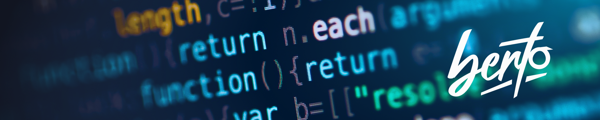

<b>🕵🏼‍♂️ FOR ALL RECRUITERS</b>: YOU CAN FIND ALL MY <b><a href="#folders-and-projects">REPO AND PROJECTS IN THIS LIST</a></b> &nbsp;&nbsp;|&nbsp;&nbsp;**[ OPEN WEBSITE ➜ ](https://berto.dev/)**

 

 
 
<!--
-->

<table><tr><td>

<!---->

 
  

    <b>DIGIΓΔL / IT ROMA</b> https://berto.dev /DEVEET GROUP<b> 
    👋 Hello World! I’m Alberto, aka @berto-dev </b>
     
    <code>"An ex creative passed to darkside of force... the codes."</code>
     
     
    
    &nbsp;
    
    &nbsp;
    
     <!--
    &nbsp;
    
    -->
    &nbsp;
    
    &nbsp;
    
     
    56K Generation. I'm started with tapes in commodore 64 (floppies was rare), now <wbr>I make modern designs and software structures, line by line and code by code.
     
    <b>{ FULLSTACK JS - NODE - PHP - C# }</b>
  

 

</td></tr></table>
  

  
## <b>🚀🧠 systems, tools and technologies</b>

&nbsp;&nbsp;&nbsp; 

## Folders and projects:

> 🛈 This is the folders projects list with all public repository and code inside

<a href="https://github.com/js-collection" target="_blank">
    
    <b>JS-COLLECTION : A javascript resources and techniques collection</b> 
    A collection of js commons patterns, tutorials, methods and other...
</a>
  
<a href="https://github.com/js-exp-collection" target="_blank">
    
    <b>JS-EXP : javascript experiments collection [warning: we transfering it on js-collection]</b> 
    A collection of randomic js experimental scripts
</a>
  
<a href="https://github.com/node-js-collection" target="_blank">
    
    <b>Node Js: Open & Private js server collection</b> 
    A closed source complete server system + plugin in nodejs and more...
</a>
  
<a href="https://github.com/js-react-collection" target="_blank">
    
    <b>JS-React collection</b> 
    Open source boilerplates etc for react projects
</a>
  
<a href="https://github.com/wusy-project" target="_blank">
    
    <b>Wusy: Web Ui System</b> 
    Open source ui libs for web / app
</a>
  
<a href="https://github.com/ShapeGroup/kimera-frontend-framework" target="_blank">
    
    <b>kimera frontend framework</b> 
    An open ui web framework of web 2.0 
</a>
  
<a href="https://github.com/git-tricks-collection" target="_blank">
    
    <b>Git Tricks Collection</b> 
    A collection of git and github flows, tips and tricks 
</a>
  
<a href="https://github.com/berto-dev/wamp-theme" target="_blank">
    
    <b>Wamp Modern Theme</b> 
    An alternative and clear theme for wamp 
</a>
  
<a href="https://github.com/wp-collection" target="_blank">
    
    <b>wordpress collection</b> 
    An open collection of resources and extensions for wordpress
</a>

<!--
info:
💬
find emoji:  https://emojipedia.org/emoji/
find me on google: https://www.google.com/search?client=firefox-b-d&q=addme+to+search
How to badge: https://shields.io/category/build
All icons: https://simpleicons.org/
custom stats:
  on https://github.com/anuraghazra/github-readme-stats +++ &hide=html&hide_border=false&card_width=320&layout=compact&text_color=dimgray&title_color=cyan&icon_color=aqua&bg_color=WhiteSmok
  
  src="https://github-readme-stats.vercel.app/api/wakatime?username=ebfeebe0-ae51-4c38-8521-9b0bf9402c6e&langs_count=7&custom_title=Runtime&nbsp;Stats&hide_border=false&titletext_color=dimgray&title_color=cyan&icon_color=aqua&bg_color=WhiteSmok"

https://berto-dev.github.io/
https://berto.dev/

-->

<!--

-->
